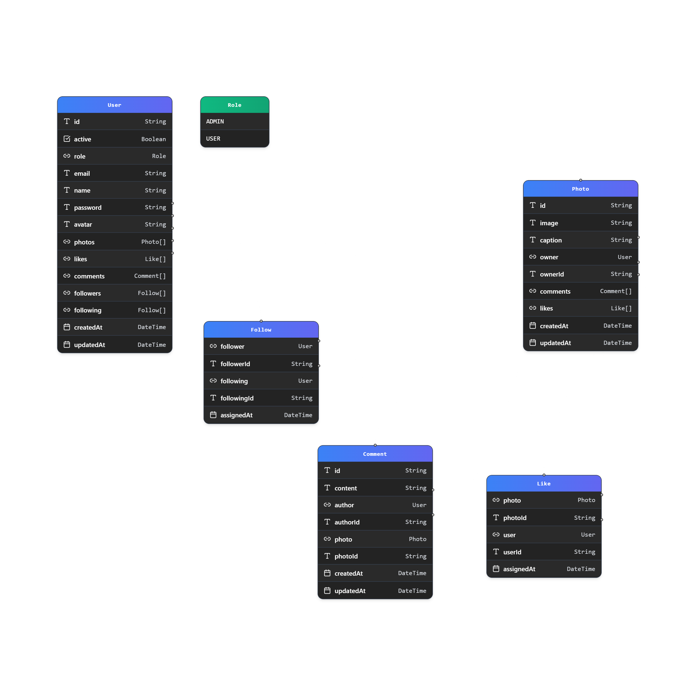

# 📷 Instagram Clone 🤳

## Environment Variables:

<details>
<summary>
<strong>Click to view variables</strong>
</summary>

-         AUTH_SECRET
-         DATABASE_URL

</details>

## Set Up Instructions:

<details>
<summary>
<strong>Click to view instructions</strong>
</summary>

- Download dependencies by running:

          pnpm install

- Start up the app using:

          pnpm run

</details>

## User Credentials:

<details>
<summary>
<strong>Click to view credentials</strong>
</summary>

- You can use any one of the following credentials:

  ```text
  email: user1@example.com
  password: Abc123*
  ```

  ```text
  email: user2@example.com
  password: Abcd123*
  ```

  ```text
  email: user3@example.com
  password: Abcd123*
  ```

  ```text
  email: user4@example.com
  password: Abcd123*
  ```

  ```text
  email: user5@example.com
  password: Abcd123*
  ```

  ```text
  email: user6@example.com
  password: Abcd123*
  ```

- Or register a new user with a **valid** email and password:

</details>

## UML Diagram:

<details>
<summary>
<strong>Click to view diagram</strong>
</summary>



</details>
